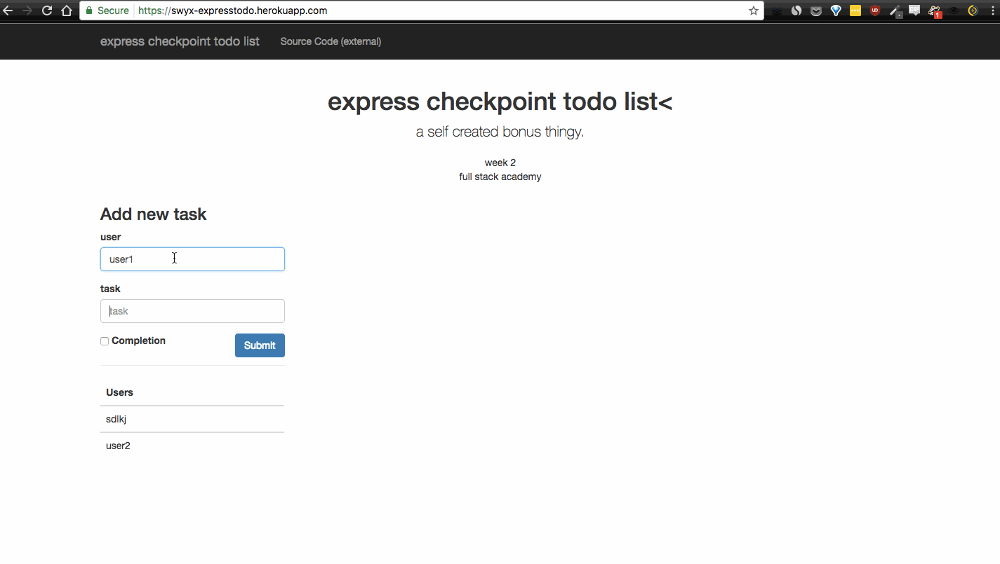

# note from swyx

This is my completed tasks from the express checkpoint assigned in FSA week 2.

The task was a basic application of express routing on an in-memory storage of todo items with various states of completion. The test specs dont include full todo list functionality so don't expect it.

There was no bonus task so i made it a challenge to put a frontend on this task (where all the routes had been set up)

I went with a vue application powered by jquery for ajaxing and bootstrap for the design.

Bootstrap template from <https://startbootstrap.com/template-overviews/logo-nav/>

I also used the <https://github.com/CodeSeven/toastr> library for notifications because it looks nice

## Some technical things i wrestled with:
- vue animations dont work very nicely when you bind data to an element and then change the data. [in fact they dont work at all](https://stackoverflow.com/questions/43050109/vue-js-transition-on-data-change). 
i had to fudge it with a [v-if and v-else of the same exact element](https://vuejs.org/v2/guide/transitions.html#Transitioning-Between-Elements). i dont think this is the right way but i cant figure out how to do it.
- when returning a response with a `204` status code, you cant attach any data payload. this tripped me up quite a bit.

The thingy is hosted here: <https://swyx-expresstodo.herokuapp.com/>